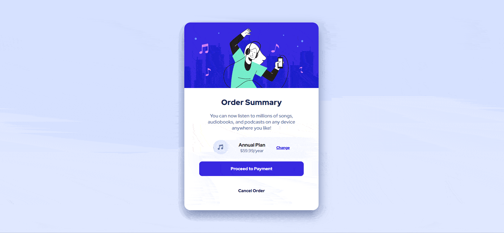
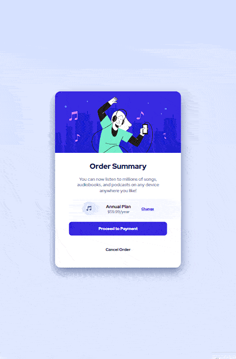
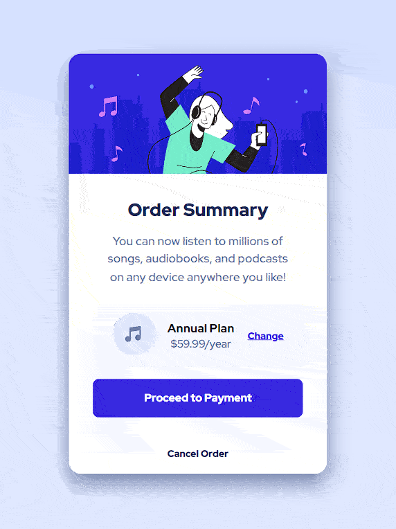

# Frontend Mentor Challenge | Order Summary Component


#### Este é mais um desafio vindo do @Frontendmentor, é um exemplo de um menu para compra de um pacote de aplicativo.

## Índice

- [Capturas de telas](#capturas-de-telas)
- [Links](#links)
- [Construído com](#construído-com)
- [O que aprendi](#o-que-aprendi)
- [Desenvolvimento contínuo](#desenvolvimento-contínuo)
- [Recursos úteis](#recursos-úteis)
- [Luis Fernando Guimaraes](#autor)

### Capturas de telas

#### Tela Desktop



#### Tela Ipad



#### Tela Mobile



### Links

- Site URL: https://luis92guimaraes.github.io/order-summary-component/

### Construído com

<div style="display: inline_block"><br>
  
       
</div>

### O que aprendi

Esse exercicio é proposto dentro do site @Frontend Mentor, foi um exercício que me permitiu ampliar meu conhecimento com o uso da propriedade Background e também com a utilização da propriedade Box-shadow. 

## Trechos de códigos

```
.container {
    background: url(/src/images/pattern-background-desktop.svg) center top no-repeat fixed;
    background-size: contain;
    display: flex;
    justify-content: center;
    align-items: center;
    height: 100vh;
}

.container .card {
    background-color: var(--bg-card-color);
    display: flex;
    flex-direction: column;
    width: 450px;
    height: 630px;
    border-radius: 20px;
    box-shadow: 0 15px 35px var(--text-color);
}

.container .card .image {
    overflow: hidden;
    width: 100%;
    height: 220px;
    border-radius: 20px 20px 0 0;
}
```

### Desenvolvimento contínuo

Pretendo continuar aprendendo cada vez mais sobre as ferramentas utilizadas nesse projeto, ainda tem muita coisa pra ser absorvida mas sigo confiante e feliz em estar conseguindo tornar meu conhecimento solido e poder realizar projetos como esse com mais clareza e confiança a cada dia de estudos.

### Recursos úteis

- [Mdn](https://developer.mozilla.org/en-US/) - O Mozilla Developer Network (MDN) desempenha um papel crucial ao fornecer recursos abrangentes e atualizados para desenvolvedores web em todo o mundo.
- [W3School](https://www.w3schools.com/css/default.asp) - Esse site sempre me ajuda a resolver qualquer problema relacionados a códigos de uma maneira fácil e muito rápida.
- [Dev em Dobro](https://www.youtube.com/@DevemDobro) - Este é um canal onde encontro muito material. Tem muito conteúdo relacionado ao desenvolvimento. Recomendo a todos que querem aprender sobre esse e outros conceitos relacionados.

## Autor

[Luis Fernando Guimarães](https://www.linkedin.com/in/luisfguimaraes/)
